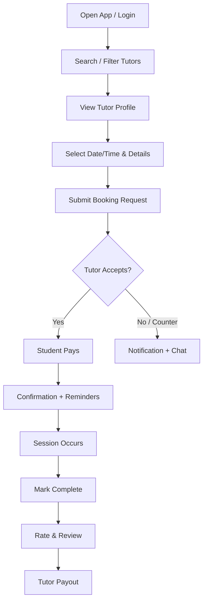

```markdown
# SmartBimbel – Product Requirements Document (PRD)

**Version:** 1.0  
**Date:** 11 August 2026  
**Status:** Draft for MVP  
**Product Owner:** [Your Name]  

---

## 1. Overview

**Product Name:** SmartBimbel  
**Tagline:** Temukan tutor privat terbaik, jadwalkan les dengan mudah.

**Vision**  
Become the leading marketplace platform in Indonesia that connects students and parents with qualified private tutors (guru privat / bimbel privat) for flexible, high-quality one-on-one learning — online or offline.

**Mission**  
Make private tutoring accessible, transparent, trustworthy, and convenient by solving the problems of discovery, scheduling, payment, and trust.

**Product Type**  
Two-sided marketplace  
- Mobile-first application (Android priority + iOS)  
- Responsive web application  
- Admin web panel

**Core Value Proposition**
- **Students / Parents:** Quickly find verified tutors matched by subject, level, location, budget, and schedule.
- **Tutors:** Acquire more students, manage availability & earnings easily, and build reputation through reviews.
- **Platform:** Earn commission on successful bookings.

**Target Market**  
Indonesia (initial focus: Jabodetabek, Bandung, Surabaya, Medan, Yogyakarta, and other major cities).  
Primary segments: SD – SMA students, UTBK/SNBT preparation, and general school subjects.

---

## 2. Problem Statement

- Finding reliable private tutors is still mostly done through WhatsApp groups, word-of-mouth, or social media, resulting in inconsistent quality, opaque pricing, scheduling friction, and payment risks.
- Major existing platforms (Ruangguru, Zenius, etc.) focus primarily on content, live classes, or packaged programs rather than flexible peer-to-peer private tutor matching.
- Freelance tutors and part-time teachers struggle to find consistent students and manage bookings and payments efficiently.
- Parents want convenience, safety, transparency, local payment methods, and basic progress visibility.

---

## 3. Goals & Success Metrics (MVP – First 3–6 Months)

### Primary Goals
- Validate real demand for a private tutor marketplace.
- Achieve product-market fit in at least 2–3 major cities.
- Enable a complete transaction loop: Discover → Book → Pay → Complete → Review.

### Key Success Metrics
| Metric                        | Target (MVP)      |
|-------------------------------|-------------------|
| Registered Tutors             | 500+              |
| Registered Students/Parents   | 2,000+            |
| Completed Bookings            | 1,000+            |
| Booking Conversion Rate       | Track & improve   |
| Average Session Rating        | ≥ 4.5             |
| GMV & Platform Take Rate      | Track             |
| Student Second Booking Rate   | Track             |
| Tutor Activation Rate         | ≥ 40%             |

---

## 4. User Personas

**Persona 1 – Parent (Primary Buyer)**  
Ibu Rina, 38, Jakarta. Has a child in SMP. Busy professional who values trust, convenience, flexible scheduling, and clear communication.

**Persona 2 – Student**  
Andi, 16, SMA. Needs Mathematics and English for UTBK. Mobile-first user looking for affordable and effective tutors.

**Persona 3 – Tutor**  
Budi, 24, recent graduate / part-time teacher. Teaches Math & Physics. Wants more students, flexible schedule control, easy payments, and reputation building.

**Persona 4 – Admin / Platform Operator**  
Responsible for quality control, dispute resolution, payouts, and platform growth.

---

## 5. User Roles & Permissions

- **Student / Parent**
- **Tutor**
- **Admin** (Super Admin + Support staff)

---

## 6. Functional Requirements

### 6.1 MVP Must-Have Features

#### A. Authentication & Onboarding
- Phone number + OTP (primary method), email, and Google login.
- Role selection during registration (Student/Parent or Tutor).
- Multi-step tutor profile completion (photo, bio, subjects, grade levels, rates, teaching mode, location, education background, availability).
- Basic tutor verification (manual admin review of KTP and/or diploma).
- Student/Parent profile: grade level, subjects of interest, preferred location/mode.

#### B. Tutor Discovery & Search
- Browse tutors in list/grid view (photo, name, subjects, rate, rating, location, online/offline badge).
- Filters: subject, grade level (SD/SMP/SMA/UTBK, etc.), price range, city/area, rating, teaching mode, availability.
- Keyword search and sorting (rating, price, nearest).
- Detailed tutor profile page with reviews, availability calendar, and “Book Now” call-to-action.

#### C. Booking & Scheduling
- Tutor can set recurring or one-off availability slots.
- Student selects date, time, duration (60/90/120 minutes), subject, mode (online/offline), and notes/goals.
- Booking request flow → Tutor accepts / declines / proposes alternative.
- Automatic confirmation and calendar views (Upcoming / Past / Cancelled).
- Reschedule and cancel rules (e.g., free cancellation ≥ 12–24 hours before).
- Multi-channel notifications: Push + Email + WhatsApp.

#### D. In-App Messaging
- Real-time chat between student/parent and tutor (activated after booking request or confirmation).
- Ability to share Zoom/Google Meet links or offline meeting addresses.
- Keep communication on-platform in the early stages.

#### E. Payments
- Integration with Midtrans or Xendit supporting:
  - QRIS, GoPay, OVO, Dana, ShopeePay, Virtual Account, Bank Transfer.
- Payment triggered upon booking confirmation (or optional post-session for early trust).
- Configurable platform commission (default recommendation: 15%).
- Tutor earnings dashboard and payout request (to bank account).
- Full transaction history for both sides.
- Basic refund and dispute handling (admin-mediated).

#### F. Session Management
- Role-specific dashboards.
- Ability to mark session as completed.
- “Join Meeting” button for online sessions (opens external Zoom/Google Meet link).
- Basic post-session notes.

#### G. Ratings & Reviews
- After session completion: star rating + optional text review.
- Average rating and recent reviews displayed on tutor profiles.

#### H. Admin Panel (Web)
- Approve / reject tutor profiles.
- Manage users, bookings, transactions, and disputes.
- Basic analytics (users, GMV, bookings, conversion).
- Content moderation and payout approval.

### 6.2 Post-MVP / Phase 2 Features
- Lesson packages and subscriptions
- Recurring bookings
- Multi-child parent accounts
- Progress reports and simple homework sharing
- Favorites, promo codes, referral system
- Verification badges
- Deeper video/whiteboard integration
- Advanced matching & recommendations
- Tutor performance analytics
- Group sessions

---

## 7. Non-Functional Requirements

- **Localization:** Full Bahasa Indonesia interface + English option. All prices in IDR.
- **Performance:** Page/app load < 3 seconds on typical 4G networks. Smooth experience on mid-range Android devices.
- **Security:** Encrypted data, secure authentication, PCI-compliant payment handling, compliance with Indonesian personal data protection principles.
- **Scalability:** Designed to support thousands of concurrent users initially and grow further.
- **Reliability:** Target 99.5%+ uptime.
- **Mobile-First & Responsive Design**
- **Notifications:** Firebase Cloud Messaging + WhatsApp Business API + email/SMS fallback.
- **Analytics:** Event tracking via Firebase Analytics + Mixpanel/Amplitude.
- **Error Monitoring:** Sentry

---

## 8. Key User Flows

### Student Booking Happy Path

1. Student/Parent registers or logs in and completes basic profile.
2. Searches and filters tutors → views detailed profile.
3. Selects available time slot and fills booking details → submits request.
4. Tutor receives notification and accepts the request.
5. Student completes payment.
6. Both parties receive confirmation and reminders.
7. Session takes place (online link or offline meeting).
8. Session is marked complete → ratings and reviews are exchanged.
9. Tutor receives payout (after platform commission).

### Mermaid Diagram – Student Booking Flow



### Tutor Onboarding Flow
Register → Select Tutor role → Complete multi-step profile → Submit for verification → Admin approval → Profile goes live → Set availability.

---

## 9. Recommended Tech Stack (MVP)

| Layer              | Technology                                      | Notes |
|--------------------|--------------------------------------------------|-------|
| Mobile App         | Flutter                                          | Single codebase, excellent performance |
| Web (User + Admin) | Next.js (React)                                  | Responsive + fast |
| Backend            | NestJS (Node.js) or Supabase                     | NestJS recommended for structure |
| Database           | PostgreSQL + Redis                               | Relational data + caching |
| Authentication     | Firebase Auth / Supabase Auth + Phone OTP        | |
| Payments           | Midtrans or Xendit                               | Best local coverage (QRIS etc.) |
| File Storage       | AWS S3 / Cloudinary / Firebase Storage           | Profile photos & documents |
| Real-time Chat     | Socket.io / Supabase Realtime / Stream Chat      | |
| Notifications      | FCM + WhatsApp Business API                      | Critical for Indonesia |
| Maps               | Google Maps Platform                             | |
| Hosting            | Railway / Render / AWS + Vercel                  | |
| Analytics          | Firebase Analytics + Mixpanel/Amplitude          | |
| Error Tracking     | Sentry                                           | |
| CI/CD              | GitHub Actions                                   | |

**Video Sessions:** External Zoom or Google Meet links (no custom WebRTC in MVP).

---

## 10. High-Level Data Models

- Users (with role)
- TutorProfiles
- StudentProfiles
- Subjects & GradeLevels (master data)
- AvailabilitySlots
- Bookings / Sessions
- Conversations & Messages
- Transactions / Payments
- Reviews
- Payouts

---

## 11. Monetization Model

- Primary: Commission on each successfully completed booking (recommended starting rate: 15%, configurable).
- Future opportunities: Featured listings, premium tutor subscriptions, package markups, advertising.

---

## 12. Assumptions, Constraints & Risks

**Assumptions**
- Tutors are willing to join the platform for free in the early stage.
- Students/parents are comfortable paying online via local methods.
- WhatsApp notifications will significantly increase engagement and reduce no-shows.

**Constraints**
- Launch focused on major cities.
- Manual tutor verification at the beginning.
- External video tools only in MVP.

**Key Risks & Mitigations**
- Cold-start problem → Seed supply with existing tutor networks + early incentives.
- Trust & safety → Verification process + reviews + in-app communication + clear dispute flow.
- Payment friction → Strong local payment options + clear UX.
- Competition → Differentiate through pure private-tutor flexibility and superior local experience.

---

## 13. High-Level Roadmap

| Phase          | Duration       | Focus |
|----------------|----------------|-------|
| Phase 0        | 2–4 weeks      | Design system, tech setup, core data models |
| Phase 1 – MVP  | 8–14 weeks     | All must-have features, internal testing, soft launch in 1–2 cities |
| Phase 2        | Ongoing        | Packages, better matching, progress tools, city expansion |
| Phase 3        | Future         | Advanced features, scale, possible B2B offerings |

---

## 14. Open Questions

- Final commission rate and detailed cancellation policy?
- Online-only launch or online + offline from day one?
- Priority cities for soft launch?
- Development team size, skills, and budget?
- Legal entity, Terms of Service, and personal data protection compliance plan?

---

**Document Control**  
This PRD serves as the single source of truth for product, design, and engineering teams. Updates will be versioned.

---
