# Data Model

Source of truth is [`services/api/prisma/schema.prisma`](../services/api/prisma/schema.prisma) — this document is a human-readable companion to it, not a separate spec. Regenerate/update this diagram whenever the schema changes meaningfully.

Covers every entity from [PRD §10](PRD.md#10-high-level-data-models): Users, TutorProfiles, StudentProfiles, Subjects & GradeLevels, AvailabilitySlots, Bookings, Conversations & Messages, Transactions, Reviews, Payouts.

## Entity-Relationship Diagram

```mermaid
erDiagram
    User ||--o| TutorProfile : "has"
    User ||--o| StudentProfile : "has"
    User ||--o{ Message : "sends"

    TutorProfile }o--o{ Subject : "teaches"
    TutorProfile }o--o{ GradeLevel : "teaches"
    TutorProfile ||--o{ AvailabilitySlot : "defines"
    TutorProfile ||--o{ Booking : "receives"
    TutorProfile ||--o{ Payout : "requests"

    StudentProfile }o--o{ Subject : "interested in"
    StudentProfile ||--o{ Booking : "makes"
    StudentProfile }o--|| GradeLevel : "is in"

    AvailabilitySlot ||--o{ Booking : "held by"

    Booking ||--o| Conversation : "has"
    Booking ||--o| Transaction : "has"
    Booking ||--o| Review : "has"
    Booking }o--|| Subject : "about"

    Conversation ||--o{ Message : "contains"

    User {
        string id PK
        UserRole role
        string phone UK
        string email UK
        string firebaseUid UK
        UserStatus status
    }

    TutorProfile {
        string id PK
        string userId FK
        int hourlyRate
        TeachingMode[] teachingModes
        string city
        VerificationStatus verificationStatus
    }

    StudentProfile {
        string id PK
        string userId FK
        string gradeLevelId FK
        string preferredLocation
        TeachingMode preferredMode
    }

    Subject {
        string id PK
        string name UK
    }

    GradeLevel {
        string id PK
        string name UK
    }

    AvailabilitySlot {
        string id PK
        string tutorId FK
        int dayOfWeek
        datetime date
        string startTime
        string endTime
        boolean isRecurring
    }

    Booking {
        string id PK
        string studentId FK
        string tutorId FK
        string subjectId FK
        string availabilitySlotId FK
        datetime scheduledAt
        int durationMinutes
        TeachingMode mode
        BookingStatus status
    }

    Conversation {
        string id PK
        string bookingId FK
    }

    Message {
        string id PK
        string conversationId FK
        string senderId FK
        string body
    }

    Transaction {
        string id PK
        string bookingId FK
        int amount
        int commission
        string gatewayRef
        TransactionStatus status
    }

    Payout {
        string id PK
        string tutorId FK
        int amount
        PayoutStatus status
        string bankAccountRef
    }

    Review {
        string id PK
        string bookingId FK
        int rating
        string text
    }
```

## Notes on scope

- **Booking status enum** is intentionally minimal for Sprint 0 (`REQUESTED, ACCEPTED, DECLINED, CONFIRMED, COMPLETED, CANCELLED`). Sprint 3 (booking flow) will add whatever additional states its counter-propose/expiry logic needs via its own migration, rather than guessing them now.
- **Payout batching and dispute/refund tables are not modeled yet** — deliberately deferred to Sprint 5 (payments) and Sprint 7 (admin/disputes) per [Task 0.4](sprints/sprint-00-foundation/task-4-database-schema.md)'s own scope note, to avoid speculative schema that might not match what those sprints actually need.
- **`TutorProfile.subjects` / `.gradeLevels`** and **`StudentProfile.subjectsOfInterest`** are modeled as Prisma implicit many-to-many relations (Postgres join tables `_TutorSubjects`, `_TutorGradeLevels`, `_StudentSubjectsOfInterest`), not scalar arrays — both sides need referential integrity against the `Subject`/`GradeLevel` master data tables.
- **`AvailabilitySlot.startTime`/`endTime`** are stored as `"HH:mm"` strings in the tutor's local time rather than full timestamps, since a recurring weekly slot has no fixed date. Sprint 3's availability management task is where the timezone-aware scheduling logic that interprets these actually gets built.
